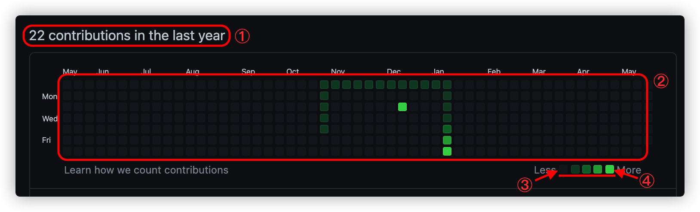

# gitsnackhub extension

Play snake game on Github contribution chart 🎉.

This is a browser extension for Chrome that lets you convert GitHub contribution chart to a game board and play snake
game on it.

## Installation

currently unavailable.

## How to play

1. Double click summary __more__ to open game mode.
2. Use arrow ↑↓←→ to move.
3. Use SPACE to reset game while game over.
4. Have fun.

## Tech Stack

+ [KotlinJS](https://kotlinlang.org/docs/js-overview.html)

## LICENSE

MIT
